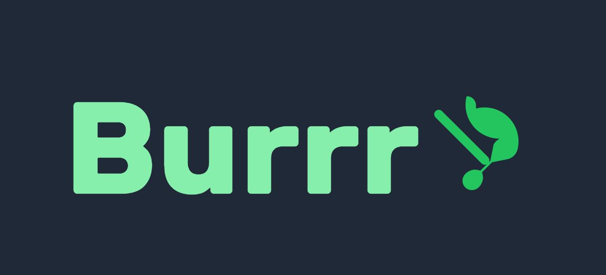

# Burrr - A Modern Blogging Platform 🌟



Burrr is a modern, full-stack blogging platform built with **Next.js**, **Tailwind CSS**, and **SQL (Neon.tech)**. It allows users to create, share, and interact with posts in a seamless and intuitive way. Whether you're a blogger, developer, or just someone who loves to share ideas, Burrr is the perfect platform for you!

## ✨ Features

- **Intuitive Post Creation**: 
  Write and publish posts with a rich text editor, supporting markdown, titles, and custom tags.

- **Interactive Engagement**: 
  Foster community interaction through likes, comments, and sharing capabilities.

- **Secure Authentication**: 
  Robust user authentication system with JWT tokens ensuring data privacy and security.

- **Smart Content Management**: 
  Efficient pagination, search functionality, and multiple sorting options for better content discovery.

- **Modern UI/UX**: 
  Sleek, responsive design with smooth animations and mobile-first approach.

## 🛠️ Tech Stack

### Frontend
- **Next.js**: React framework for production-grade applications
- **Tailwind CSS**: Utility-first CSS framework for rapid UI development
- **Framer Motion**: Production-ready animation library
- **React Icons**: Popular icon set for React applications

### Backend
- **Next.js API Routes**: Serverless API endpoints
- **Neon.tech**: Serverless Postgres database
- **JWT**: Secure user authentication

### Tools & Utilities
- **Axios**: Promise-based HTTP client
- **React-Toastify**: Toast notifications
- **Various UI Components**: Custom-built for optimal user experience

## 📸 Screenshot Gallery

Here's a glimpse of Burrr in action:


*Home page with featured posts*


*Intuitive post creation interface*


*User profile dashboard*

## 🚀 Getting Started

### Prerequisites

- Node.js (v16 or higher)
- npm or yarn
- Neon.tech account
- Git

### Installation Steps

1. **Clone the repository**
   ```bash
   git clone https://github.com/yourusername/burrr.git
   cd burrr
   ```

2. **Install dependencies**
   ```bash
   npm install
   # or
   yarn install
   ```

3. **Environment Setup**
   Create a `.env.local` file in the root directory:
   ```env
   DATABASE_URL=your_neon_database_url
   JWT_SECRET=your_jwt_secret
   NEXT_PUBLIC_API_URL=your_api_url
   ```

4. **Run the development server**
   ```bash
   npm run dev
   # or
   yarn dev
   ```

5. **Open your browser**
   Navigate to `http://localhost:3000`

## 📁 Project Structure

```
burrr/
├── app/                 # Next.js app directory
│   ├── api/            # API routes
│   ├── components/     # Reusable components
│   ├── lib/           # Utility functions
│   └── pages/         # Page components
├── public/             # Static assets
├── styles/            # Global styles
└── ss/                # Screenshot directory
```

## 🔍 Key Features Usage

### Creating a Post
1. Log in to your account
2. Click the "New Post" button
3. Fill in the title, content, and tags
4. Click "Publish"

### Interacting with Posts
- Like posts by clicking the heart icon
- Comment on posts using the comment section
- Share posts using the share button

### Managing Your Profile
- Update your profile picture and bio
- View your published posts
- Track your interactions

## 🤝 Contributing

We welcome contributions! Please feel free to submit a Pull Request.

1. Fork the project
2. Create your feature branch (`git checkout -b feature/AmazingFeature`)
3. Commit your changes (`git commit -m 'Add some AmazingFeature'`)
4. Push to the branch (`git push origin feature/AmazingFeature`)
5. Open a Pull Request

## 📄 License

This project is licensed under the MIT License - see the [LICENSE](LICENSE) file for details.

## 🙏 Acknowledgments

- Thanks to all contributors who have helped shape Burrr
- Special thanks to the Next.js and Tailwind CSS communities
- All the amazing developers who create and maintain the tools we use

---

Made with ❤️ by Bishal